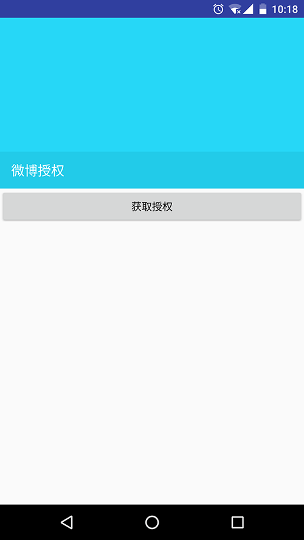

最前面
-----------------------------
其实半成品都不算,算个demo....

吐槽!
-------------------------------
微博的接口真是太坑了（可能是我码力不行0.0），写到一半实在不想写了，不知道大家有没有好用的数据源可以拿来写个完整的app的，求推荐！  

还是简单描述下吧...
-------------------------------
##授权  
  
##列表  
  
##列表 黑夜(皮肤)  
  
##详情，就是个webView，稍稍处理了下～～  
  

最后再说两句...
------------------------------
小学生编码风格，如果真的要看，请看完就忘掉吧～～  
主要是用来练习各种第三方库的用法，kotlin 语法，以及本着一种多写多练总能提升的精神.....

用到的第三方库
-------------------------------
 - [greendao](https://github.com/greenrobot/greenDAO)  
	greenDAO is a light & fast ORM solution for Android that maps objects to SQLite databases.
 - gson  
 - [retrofit](https://github.com/square/retrofit)  
	Type-safe HTTP client for Android and Java by Square, Inc.
 - [glide](https://github.com/bumptech/glide)  
	An image loading and caching library for Android focused on smooth scrolling
 - [glide-transformations](https://github.com/wasabeef/glide-transformations)  
	An Android transformation library providing a variety of image transformations for Glide.
 - [AndPermission](https://github.com/yanzhenjie/AndPermission)  
	Android Runtime Permission，support the right to apply for permission at any place.
 - [AndroidUtilCode](https://github.com/Blankj/AndroidUtilCode)  
	Android开发人员不得不收集的代码
 - [BRVAH](http://www.recyclerview.org/)  

	RecyclerView作为Android最常用的控件之一，BRVAH受益群体几乎是所有Android开发者，希望更多开发者能够一起来把这个项目做得更好，帮助更多人

	高效的使用RecyclerView应对项目中的常见需求的Adapter
 - [Android-skin-support](https://github.com/ximsfei/Android-skin-support)  
	Android-skin-support: 一款用心去做的Android 换肤框架, 极低的学习成本, 极好的用户体验. 只需要两行代码, 就可以实现换肤, 你值得拥有!!!
 - [android-Ultra-Pull-To-Refresh](https://github.com/liaohuqiu/android-Ultra-Pull-To-Refresh)  
	Ultra Pull to Refresh for Android. Support all the views.
 - [agentweb](https://github.com/Justson/AgentWeb)  
	 AgentWeb 是基于 Android WebView 一个功能完善小型浏览器库 。 使用很方便 ， 集成进你应用 ，只需几行代码 。
